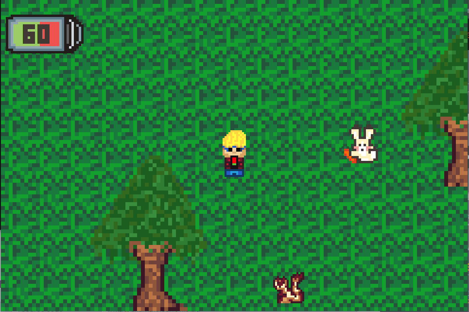

# Game for Ludum Dare 46

Game of Ludum Dare 46 :D

Using my own 2D game engine done is SDL2 [Skygine](https://github.com/AsierFox/Skygine)

My Ludum Dare 46 [COMPO submission](https://ldjam.com/events/ludum-dare/46/be-cool-or-die)
[Itch.io COMPO submission](https://skyfoxx.itch.io/be-cool-or-die)

## Description
One day, a cool teenager was trying filtering with his crush. This pretty girl liked a lot wild animals. So our cool guy decided to go to the forest to take some photos of this animals.
Go! And take as much photos as you can of the wild animals! :smile: 

> **NOTE:** It's not implemented the 'take photos' feature jeje It's a critic for the new techonologies. I would like to finish another scene where you achieve X time keeping battery alive and he ends up throwing the phone and enjoying the nature.
Sorry about that :( The next jam I will improve, I swear it :smile: 

#### Personal note
This is my first Ludum Dare game! I learned lots of things during the development and it has motivated me a lot!! I developed this game using my own game engine [Skygine](https://github.com/AsierFox/Skygine) done in SDL2 and I'm so proud of it :)
I hope that with the experience achived here I can improve my own skills of developmnet and design!! Thank you so much for playing my game and see you in the next LD!! :wink: 

